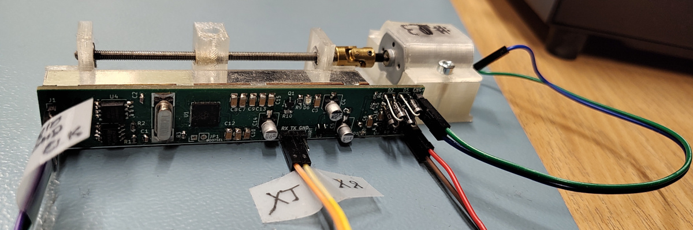

# YALF: Yet Another Linear Servo

project to build a linear servo for RC models.

## key project assumptions

* long move range
* digital position control
* digital feedback on current servo position
* 12V power supply (directly from battery)
* does not consume power when not moving, while still keeping position
* possible magnetic coupling with element moved

## assembly

### BOM
* 1x PCB assembly (see `baord/hw` - build it to get `board/hw/build/bom.csv`)
* 1x MT44 DC motor
* 2x 3x7x3mm ball bearing
* 1x 3mm-3mm universal joing (aka: Cardan joint)
* 1x 3mm threaded rod (~12cm)
* 3x 3mm threaded inset (1x for carriage and 2x for engine)
* 2x M3x14 screws (engine mount)
* 2x M3x10 screws (potentiometer mount)

### tools
* soldering iron
* 3D printer for YALS' body
* hex-key set
* pico-probe or raspberry pi SBC to flash `rp2040` µC
